# FableLands

## Introduction

FableLands represents a paradigm shift in the NFT space, introducing truly autonomous on-chain companions that exist as living, breathing entities on the Stellar blockchain. Unlike traditional static NFTs, FableLands pets are dynamic digital beings that experience hunger, loneliness, and emotional states. They remember interactions, evolve over time, and engage in meaningful conversations through advanced AI integration.

What if your NFT could get hungry? What if it could feel lonely? What if it could remember you played a game with it? What if it could talk back?

FableLands answers these questions by creating a Crypto-AI game that enables genuine, emotional bonds between users and their digital companions. Each pet is a unique NFT with its own personality, memory, and lifecycle, all managed entirely on-chain through Stellar smart contracts.

## Architecture Overview

FableLands is built on a multi-layered architecture combining Stellar smart contracts, AI services, and modern web technologies to create an immersive pet ownership experience.

### Smart Contracts

The application leverages two primary smart contracts deployed on the Stellar Testnet, working in tandem to provide comprehensive pet management and achievement tracking functionality.

#### Contract Architecture

```mermaid
graph TB
    subgraph "PetWorld Contract"
        subgraph "Instance Storage"
            IS1[Owner Address]
            IS2[NextTokenId Counter]
            IS3[BlocksPerHungerPoint: 30]
            IS4[BlocksPerHappinessDecay: 60]
            IS5[FeedCost: 0.001 XLM]
            IS6[MintCost: 0.01 XLM]
            IS7[RevivalCost: 0.005 XLM]
            IS8[EggToBabyBlocks: 36]
            IS9[BabyToTeenBlocks: 84]
            IS10[TeenToAdultBlocks: 144]
            IS11[EvolutionHappinessThreshold: 60]
            IS12[AchievementContract Address]
        end
        
        subgraph "Persistent Storage"
            PS1[Pet struct<br/>token_id -> Pet]
            PS2[TokenOwner<br/>token_id -> Address]
            PS3[OwnerBalance<br/>Address -> u128]
            PS4[OwnerTokens<br/>Address, index -> token_id]
            PS5[TokenURI<br/>token_id -> String]
        end
        
        subgraph "Public Functions"
            F1[initialize]
            F2[mint]
            F3[update_state]
            F4[feed]
            F5[play]
            F6[revive]
            F7[get_pet_info]
            F8[get_user_pets]
            F9[batch_update_state]
            F10[transfer]
            F11[owner_of]
            F12[balance_of]
        end
        
        subgraph "Internal Functions"
            IF1[_check_and_evolve]
            IF2[_call_record_first_pet]
            IF3[_call_record_feed]
            IF4[_call_record_play]
            IF5[_call_record_evolution]
            IF6[_call_record_revival]
            IF7[_call_record_perfect_stats]
        end
        
        F1 --> IS1
        F1 --> IS2
        F1 --> IS3
        F2 --> PS1
        F2 --> PS2
        F2 --> PS3
        F2 --> PS4
        F2 --> IF2
        F3 --> PS1
        F3 --> IS3
        F3 --> IS4
        F3 --> IF1
        F4 --> F3
        F4 --> PS1
        F4 --> IF3
        F4 --> IF7
        F4 --> IF1
        F5 --> F3
        F5 --> PS1
        F5 --> IF4
        F5 --> IF7
        F5 --> IF1
        F6 --> PS1
        F6 --> IF6
        IF1 --> PS1
        IF1 --> IS8
        IF1 --> IS9
        IF1 --> IS10
        IF1 --> IS11
        IF1 --> IF5
        IF2 --> IS12
        IF3 --> IS12
        IF4 --> IS12
        IF5 --> IS12
        IF6 --> IS12
        IF7 --> IS12
    end
    
    subgraph "Achievement Contract"
        subgraph "Instance Storage AC"
            AC_IS1[Owner Address]
            AC_IS2[PetWorldContract Address]
        end
        
        subgraph "Persistent Storage AC"
            AC_PS1[Achievement struct<br/>achievement_id -> Achievement]
            AC_PS2[HasEarnedBadge<br/>Address, achievement_id -> bool]
            AC_PS3[PetHasBadge<br/>pet_token_id, achievement_id -> bool]
            AC_PS4[FeedCount<br/>Address -> u128]
            AC_PS5[PlayCount<br/>Address -> u128]
            AC_PS6[HasFirstPet<br/>Address -> bool]
            AC_PS7[HasEvolved<br/>Address -> bool]
            AC_PS8[HasRevived<br/>Address -> bool]
            AC_PS9[ReachedStage<br/>Address, stage -> bool]
            AC_PS10[Balance<br/>Address, achievement_id -> u128]
            AC_PS11[TotalSupply<br/>achievement_id -> u128]
        end
        
        subgraph "Public Functions AC"
            AC_F1[initialize]
            AC_F2[set_petworld_contract]
            AC_F3[award_achievement]
            AC_F4[record_first_pet]
            AC_F5[record_feed]
            AC_F6[record_play]
            AC_F7[record_evolution]
            AC_F8[record_revival]
            AC_F9[record_perfect_stats]
            AC_F10[get_user_achievements]
            AC_F11[get_pet_achievements]
            AC_F12[get_all_achievements]
            AC_F13[has_earned]
        end
        
        subgraph "Internal Functions AC"
            AC_IF1[_initialize_achievements]
        end
        
        AC_F1 --> AC_IS1
        AC_F1 --> AC_IF1
        AC_IF1 --> AC_PS1
        AC_F2 --> AC_IS2
        AC_F3 --> AC_IS2
        AC_F3 --> AC_PS2
        AC_F3 --> AC_PS3
        AC_F3 --> AC_PS1
        AC_F3 --> AC_PS10
        AC_F3 --> AC_PS11
        AC_F4 --> AC_IS2
        AC_F4 --> AC_PS6
        AC_F4 --> AC_F3
        AC_F5 --> AC_IS2
        AC_F5 --> AC_PS4
        AC_F5 --> AC_F3
        AC_F6 --> AC_IS2
        AC_F6 --> AC_PS5
        AC_F6 --> AC_F3
        AC_F7 --> AC_IS2
        AC_F7 --> AC_PS7
        AC_F7 --> AC_PS9
        AC_F7 --> AC_F3
        AC_F8 --> AC_IS2
        AC_F8 --> AC_PS8
        AC_F8 --> AC_F3
        AC_F9 --> AC_IS2
        AC_F9 --> AC_F3
        AC_F10 --> AC_PS2
        AC_F11 --> AC_PS3
        AC_F12 --> AC_PS1
        AC_F13 --> AC_PS2
    end
    
    IF2 -.->|invoke_contract| AC_F4
    IF3 -.->|invoke_contract| AC_F5
    IF4 -.->|invoke_contract| AC_F6
    IF5 -.->|invoke_contract| AC_F7
    IF6 -.->|invoke_contract| AC_F8
    IF7 -.->|invoke_contract| AC_F9
    
    style IS1 fill:#e1f5ff
    style IS2 fill:#e1f5ff
    style IS3 fill:#e1f5ff
    style IS4 fill:#e1f5ff
    style IS5 fill:#e1f5ff
    style IS6 fill:#e1f5ff
    style IS7 fill:#e1f5ff
    style IS8 fill:#e1f5ff
    style IS9 fill:#e1f5ff
    style IS10 fill:#e1f5ff
    style IS11 fill:#e1f5ff
    style IS12 fill:#e1f5ff
    style PS1 fill:#fff4e1
    style PS2 fill:#fff4e1
    style PS3 fill:#fff4e1
    style PS4 fill:#fff4e1
    style PS5 fill:#fff4e1
    style AC_IS1 fill:#e1f5ff
    style AC_IS2 fill:#e1f5ff
    style AC_PS1 fill:#fff4e1
    style AC_PS2 fill:#fff4e1
    style AC_PS3 fill:#fff4e1
    style AC_PS4 fill:#fff4e1
    style AC_PS5 fill:#fff4e1
    style AC_PS6 fill:#fff4e1
    style AC_PS7 fill:#fff4e1
    style AC_PS8 fill:#fff4e1
    style AC_PS9 fill:#fff4e1
    style AC_PS10 fill:#fff4e1
    style AC_PS11 fill:#fff4e1
```



#### fablelands Contract

The fablelands contract (`contracts/fablelands/src/lib.rs`) serves as the core NFT and pet management system. It implements a comprehensive pet lifecycle with the following key functionalities:

**Core Functions:**

- **`initialize(env, owner)`** - Initializes the contract with ownership and configurable constants including stat decay rates, evolution thresholds, and action costs. See [contracts/fablelands/src/lib.rs:58](contracts/fablelands/src/lib.rs#L58)

- **`mint(env, caller, name)`** - Mints a new pet NFT with a unique token ID. Each pet starts as an Egg with maximum stats (happiness: 100, hunger: 0, health: 100). The function automatically calls the achievement contract to award the "First Steps" achievement. See [contracts/fablelands/src/lib.rs:81](contracts/fablelands/src/lib.rs#L81)

- **`update_state(env, token_id)`** - Implements time-based stat decay using Stellar ledger sequence numbers. Hunger increases and happiness decreases based on elapsed ledgers since last update. Health degrades when hunger exceeds 80. The function automatically checks for death conditions and triggers evolution when thresholds are met. See [contracts/fablelands/src/lib.rs:153](contracts/fablelands/src/lib.rs#L153)

- **`feed(env, caller, token_id)`** - Reduces hunger by 40 points and increases happiness by 15 points. Requires authentication and ownership verification. Automatically calls the achievement contract to track feed count for milestone achievements. See [contracts/fablelands/src/lib.rs:233](contracts/fablelands/src/lib.rs#L233)

- **`play(env, caller, token_id)`** - Increases happiness by 25 points. Used after winning games in the frontend. Tracks play count for achievement milestones. See [contracts/fablelands/src/lib.rs:286](contracts/fablelands/src/lib.rs#L286)

- **`revive(env, caller, token_id)`** - Resurrects a dead pet with partial stats (health: 50, happiness: 30, hunger: 50). Awards the "Death Survivor" achievement. See [contracts/fablelands/src/lib.rs:329](contracts/fablelands/src/lib.rs#L329)

- **`get_pet_info(env, token_id)`** - Returns comprehensive pet information including name, birth date, age, evolution stage, current stats, and death status. See [contracts/fablelands/src/lib.rs:375](contracts/fablelands/src/lib.rs#L375)

- **`get_user_pets(env, user)`** - Returns a vector of all token IDs owned by a specific address, enabling efficient pet collection queries. See [contracts/fablelands/src/lib.rs:400](contracts/fablelands/src/lib.rs#L400)

- **`batch_update_state(env, token_ids)`** - Allows batch state updates for multiple pets, used by the automatic cron job to maintain all pets simultaneously. See [contracts/fablelands/src/lib.rs:420](contracts/fablelands/src/lib.rs#L420)

**Evolution System:**

The contract implements a four-stage evolution system (Egg → Baby → Teen → Adult) based on ledger sequence progression and happiness thresholds. Evolution is automatically checked after state updates, feed, and play actions. Each stage requires a minimum happiness level (60) and specific ledger count thresholds.

**Stat Management:**

Pets have three core stats managed entirely on-chain:
- **Happiness** (0-100): Decreases over time, increases through feeding and playing
- **Hunger** (0-100): Increases over time, decreases through feeding
- **Health** (0-100): Decreases when hunger exceeds 80, increases when well-fed and happy

**Contract Address:**
- **Testnet:** `CCLH6KHEBKNUX4MOLDKINELR34UWXNTFXCF5XXXSGCT4EZKXQN47U3YE`
- **Explorer:** [View on Stellar Explorer](https://stellar.expert/explorer/testnet/contract/CCLH6KHEBKNUX4MOLDKINELR34UWXNTFXCF5XXXSGCT4EZKXQN47U3YE)

#### Achievement Contract

The Achievement contract (`contracts/fablelands_achievements/src/lib.rs`) implements an ERC-1155-like achievement system that tracks user accomplishments and awards NFT badges for milestones.

**Core Functions:**

- **`initialize(env, owner)`** - Initializes the contract and pre-populates eight achievement definitions with varying rarities (Common, Uncommon, Rare, Epic, Legendary). See [contracts/fablelands_achievements/src/lib.rs:46](contracts/fablelands_achievements/src/lib.rs#L46)

- **`award_achievement(env, caller, user, achievement_id, pet_token_id)`** - Awards an achievement badge to a user. Only callable by the PetWorld contract or owner. Tracks both user-level and pet-specific achievements. See [contracts/fablelands_achievements/src/lib.rs:93](contracts/fablelands_achievements/src/lib.rs#L93)

- **`record_first_pet(env, caller, user, pet_token_id)`** - Automatically called by PetWorld contract on mint to award "First Steps" achievement. See [contracts/fablelands_achievements/src/lib.rs:157](contracts/fablelands_achievements/src/lib.rs#L157)

- **`record_feed(env, caller, user, pet_token_id)`** - Tracks feed count and awards "Streak Master" achievement after 10 feeds. See [contracts/fablelands_achievements/src/lib.rs:181](contracts/fablelands_achievements/src/lib.rs#L181)

- **`record_play(env, caller, user, pet_token_id)`** - Tracks play count and awards "Active Player" achievement after 10 plays. See [contracts/fablelands_achievements/src/lib.rs:214](contracts/fablelands_achievements/src/lib.rs#L214)

- **`record_evolution(env, caller, user, pet_token_id, stage)`** - Awards evolution-based achievements including "Metamorphosis", "Triple Evolution", and "Legend" for reaching Adult stage. See [contracts/fablelands_achievements/src/lib.rs:247](contracts/fablelands_achievements/src/lib.rs#L247)

- **`get_user_achievements(env, user)`** - Returns all achievement IDs earned by a user. See [contracts/fablelands_achievements/src/lib.rs:347](contracts/fablelands_achievements/src/lib.rs#L347)

- **`get_pet_achievements(env, pet_token_id)`** - Returns all achievement IDs earned by a specific pet. See [contracts/fablelands_achievements/src/lib.rs:365](contracts/fablelands_achievements/src/lib.rs#L365)

- **`get_all_achievements(env)`** - Returns the complete list of all available achievements with their metadata. See [contracts/fablelands_achievements/src/lib.rs:395](contracts/fablelands_achievements/src/lib.rs#L395)

- **`has_earned(env, user, achievement_id)`** - Checks if a user has earned a specific achievement. See [contracts/fablelands_achievements/src/lib.rs:410](contracts/fablelands_achievements/src/lib.rs#L410)

**Achievement Types:**

The contract defines eight achievements across five rarity tiers:
1. First Steps (Common) - Mint first pet
2. Metamorphosis (Rare) - First evolution
3. Death Survivor (Rare) - Revive a pet
4. Triple Evolution (Epic) - Reach Teen stage
5. Perfectionist (Epic) - All stats at 100
6. Streak Master (Uncommon) - Feed 10 times
7. Active Player (Uncommon) - Play 10 times
8. Legend (Legendary) - Reach Adult stage

**Contract Address:**
- **Testnet:** `CDCUYVGQWJ44NDSIITVDLYHWJGYS35LLTVVKLYQUGARH2Z7MCREBIALT`
- **Explorer:** [View on Stellar Explorer](https://stellar.expert/explorer/testnet/contract/CDCUYVGQWJ44NDSIITVDLYHWJGYS35LLTVVKLYQUGARH2Z7MCREBIALT)

#### Stellar Contract Infrastructure Utilization

FableLands leverages several key Stellar Soroban features to enable its functionality:

**Persistent Storage:**
The contracts use Soroban's persistent storage to maintain pet state, ownership mappings, and achievement records. This enables efficient on-chain data retrieval without requiring external indexing services. The PetWorld contract stores pet structs, token ownership, and user balances in persistent storage, while the Achievement contract maintains achievement definitions and user achievement mappings.

**Instance Storage:**
Configuration constants such as stat decay rates, evolution thresholds, and action costs are stored in instance storage, allowing for future upgrades and parameter adjustments without redeployment.

**Cross-Contract Invocations:**
The PetWorld contract makes cross-contract calls to the Achievement contract to automatically track user actions and award achievements. This enables seamless integration between pet management and achievement tracking without requiring users to interact with multiple contracts.

**Ledger-Based Time Tracking:**
The application uses Stellar ledger sequence numbers as a decentralized time source. Pet stats decay based on elapsed ledgers, and evolution stages progress according to ledger-based thresholds. This eliminates the need for external oracles or timestamp services.

**Authentication and Authorization:**
All state-modifying functions require authentication via `require_auth()`, ensuring only authorized users can interact with their pets. Ownership verification prevents unauthorized access to pet management functions.

**Batch Operations:**
The `batch_update_state` function enables efficient bulk updates, allowing the automatic maintenance system to update all pets in a single transaction, reducing gas costs and improving scalability.

### AI Engine

FableLands integrates multiple AI services to create dynamic, context-aware pet interactions and generate unique visual assets for each pet.

#### OpenAI Integration

The OpenAI service (`src/services/openaiService.ts`) powers conversational AI for pets, enabling natural language interactions that adapt to the pet's current state and recent history.

**Context Awareness:**

The AI system maintains comprehensive context about each pet's situation:

- **Evolution Stage Personality:** Each evolution stage (Egg, Baby, Teen, Adult) has distinct personality traits and communication styles. Eggs communicate through mystical vibrations, babies are excitable and innocent, teens are energetic but moody, and adults are wise and protective. See [src/services/openaiService.ts:18](src/services/openaiService.ts#L18)

- **Current Stats Analysis:** The system analyzes happiness, hunger, and health levels to inform the pet's emotional state. Pets express different emotions based on their stats - very hungry pets feel weak, low happiness indicates sadness, and perfect stats result in energetic expressions. See [src/services/openaiService.ts:55](src/services/openaiService.ts#L55)

- **Recent Action Memory:** The AI remembers the last action performed (feed, play, update) and acknowledges it in conversations. This creates continuity and makes interactions feel more meaningful. See [src/services/openaiService.ts:36](src/services/openaiService.ts#L36)

- **Game Context:** When users win games, the AI is informed about the specific game played (Memory Game, Tic-Tac-Toe, Rock Paper Scissors) and references it in responses, creating personalized interactions. See [src/services/openaiService.ts:33](src/services/openaiService.ts#L33)

- **Token-Specific Context:** Each pet has its own context storage using token ID-based keys, ensuring conversations are personalized to individual pets rather than generic responses. See [src/services/openaiService.ts:38](src/services/openaiService.ts#L38)

**Implementation Details:**

The service uses GPT-4o with a temperature of 0.9 for high creativity while maintaining character consistency. Responses are limited to 100 tokens to keep interactions concise and in-character. The prompt construction dynamically builds context strings based on current stats, recent actions, and user messages, ensuring each interaction is unique and relevant.

#### Image Generation Service

The image generation service (`src/services/imageGenerationService.ts`) creates unique pet avatars using AI-powered image synthesis.

**Prompt Construction:**

The service constructs detailed prompts based on multiple factors:

- **Creature Type:** Supports three creature types (dragon, unicorn, dino) with distinct visual characteristics for each. See [src/services/imageGenerationService.ts:11](src/services/imageGenerationService.ts#L11)

- **Evolution Stage:** Each stage has specific visual descriptions - Eggs are mysterious and glowing, Babies are cute and chibi-style, Teens are energetic with dynamic poses, and Adults are majestic with intricate details. See [src/services/imageGenerationService.ts:12](src/services/imageGenerationService.ts#L12)

- **Life Quality Modifiers:** The system calculates an average quality score from happiness, hunger, and health stats. Pets with high scores (>=70) appear "loved" with bright colors and sparkles, neutral scores (40-70) show balanced appearances, and low scores (<40) appear "neglected" with muted colors and shadows. See [src/services/imageGenerationService.ts:83](src/services/imageGenerationService.ts#L83)

- **Pet Name Integration:** The pet's name is included in the prompt, allowing for personalized visual elements.

**API Integration:**

The service communicates with a custom image generation API endpoint that processes prompts and returns S3-hosted image URLs. The implementation includes proxy support for development environments to handle CORS restrictions.

#### Video Generation Service

The video generation service (`src/services/videoGenerationService.ts`) generates three emotion-based videos (happy, sad, angry) from pet avatar images.

**Video Generation Process:**

The service implements an asynchronous job-based workflow:

1. **Image Upload:** The generated pet avatar image is fetched and uploaded as a FormData blob to the video generation API. See [src/services/videoGenerationService.ts:48](src/services/videoGenerationService.ts#L48)

2. **Job Creation:** The API returns a job ID for tracking the generation process. See [src/services/videoGenerationService.ts:48](src/services/videoGenerationService.ts#L48)

3. **Status Polling:** The service polls the API every 3 seconds to check generation status, with progress callbacks for UI updates. See [src/services/videoGenerationService.ts:130](src/services/videoGenerationService.ts#L130)

4. **Video Retrieval:** Upon completion, the service retrieves URLs for three videos (happy, sad, angry) which are stored in S3 and referenced in Supabase metadata. See [src/services/videoGenerationService.ts:147](src/services/videoGenerationService.ts#L147)

**Mood-Based Display:**

The frontend automatically selects and plays the appropriate video based on the pet's current mood, determined by stat thresholds:
- **Angry:** Health < 30 OR Happiness < 20
- **Sad:** Happiness < 50 OR Hunger > 70
- **Happy:** Happiness >= 70 AND Hunger < 50 AND Health >= 50
- **Neutral:** All other cases

This creates a dynamic visual experience where pets visually express their emotional state in real-time.

#### Asset Generation Orchestration

The pet asset service (`src/services/petAssetService.ts`) orchestrates the complete asset generation workflow, ensuring atomic operations where either all assets are generated successfully or the operation fails entirely.

**Generation Flow:**

1. User creation/retrieval from Supabase
2. Avatar image generation with creature-specific prompts
3. Video generation for all three emotions (happy, sad, angry)
4. Metadata storage in Supabase with all asset URLs
5. Evolution-triggered asset regeneration when pets evolve

The service includes comprehensive error handling and progress callbacks for real-time UI updates during the generation process.

### Stellar Scaffold Framework Integration

FableLands leverages the Scaffold Stellar framework to accelerate development and simplify deployment of Stellar smart contracts and frontend applications.

#### Smart Contract Development

Scaffold Stellar eliminates boilerplate by generating smart contract projects written in Rust and compiled to WebAssembly. The framework provides:

- **Automated Contract Structure:** The contracts are organized with proper Soroban SDK imports, contract types, and implementation patterns. See [contracts/fablelands/src/lib.rs](contracts/fablelands/src/lib.rs) and [contracts/fablelands_achievements/src/lib.rs](contracts/fablelands_achievements/src/lib.rs)

- **Type-Safe Contract Interfaces:** The framework generates TypeScript clients from contract definitions, enabling type-safe contract interactions in the frontend.

- **Hot Reload Support:** Contract changes are automatically detected and rebuilt, allowing for rapid iteration during development.

- **Environment Configuration:** The `environments.toml` file provides centralized configuration for different network environments (local, testnet, mainnet), simplifying deployment across networks.

#### Frontend Architecture

The frontend is built with modern TypeScript and React tooling using Vite, generated by Scaffold Stellar:

- **Component Structure:** The application follows a component-based architecture with clear separation of concerns. Pet management, game components, chat interfaces, and achievement displays are modularized for maintainability.

- **Contract Integration:** The `src/services/petworldContract.ts` service provides a clean abstraction layer for contract interactions, handling transaction building, simulation, and error management. See [src/services/petworldContract.ts](src/services/petworldContract.ts)

- **State Management:** React hooks manage application state, with custom hooks for wallet connection, balance tracking, and Supabase user management.

- **Routing:** React Router handles navigation between landing page, pet list, and pet detail views.

#### Stellar Wallet Kit Integration

The Stellar Wallet Kit is seamlessly integrated into the application, providing a standardized interface for wallet connections and transaction signing:

- **Multi-Wallet Support:** The application supports multiple Stellar wallet providers through the Wallet Kit abstraction, allowing users to connect with their preferred wallet.

- **Transaction Signing:** All contract interactions (mint, feed, play, update_state) require wallet authentication and transaction signing, handled transparently by the Wallet Kit.

- **Balance Management:** The Wallet Kit integration enables real-time balance queries and display, ensuring users are aware of their account status.

- **Network Configuration:** Wallet operations automatically use the configured network (testnet in production) from environment variables.

**Implementation:** The wallet integration is implemented in `src/hooks/useWallet.ts` and `src/providers/WalletProvider.tsx`, providing a React context for wallet state management throughout the application.

#### Deployment and Contract Management

Scaffold Stellar simplifies contract deployment through the `stellar registry` command system:

- **Contract Publishing:** Contracts are published to the Stellar registry for discoverability and versioning.

- **Instance Deployment:** Contract instances are deployed with constructor parameters, enabling multiple contract deployments with different configurations.

- **Alias Management:** Local aliases can be created for deployed contracts, simplifying development and testing workflows.

**Deployed Contracts:**
- **PetWorld Contract:** `CCLH6KHEBKNUX4MOLDKINELR34UWXNTFXCF5XXXSGCT4EZKXQN47U3YE` (Testnet)
- **Achievement Contract:** `CDCUYVGQWJ44NDSIITVDLYHWJGYS35LLTVVKLYQUGARH2Z7MCREBIALT` (Testnet)

## Core Features

### Pet Lifecycle Management

FableLands implements a complete pet lifecycle from birth to evolution, with stat management, death mechanics, and revival capabilities. Pets are born as Eggs with maximum stats and progress through four evolution stages based on time and care. The system tracks happiness, hunger, and health as independent metrics that influence pet behavior and visual appearance.

### Time-Based Stat Decay

Pets experience realistic stat decay over time, with hunger increasing and happiness decreasing based on elapsed Stellar ledger sequences. This creates urgency for user interaction and makes pet care a continuous engagement rather than a one-time action. The decay rates are configurable through contract constants, allowing for game balance adjustments.

### Evolution System

Pets evolve through four distinct stages: Egg, Baby, Teen, and Adult. Evolution is triggered automatically when pets reach specific ledger count thresholds and maintain minimum happiness levels. Each evolution stage unlocks new visual assets and personality traits in AI conversations. The evolution process is tracked on-chain and triggers automatic asset regeneration for the new stage.

### Interactive Games

The application includes three mini-games that users can play with their pets: Memory Game, Tic-Tac-Toe, and Rock Paper Scissors. Winning games increases pet happiness and triggers achievement tracking. Game results are remembered by the AI, allowing pets to reference specific games in conversations.

### Achievement System

A comprehensive achievement system tracks user accomplishments across eight different achievement types with varying rarities. Achievements are awarded automatically for milestones like first pet mint, first evolution, feeding streaks, and reaching perfect stats. The system uses an ERC-1155-like structure, allowing achievements to function as collectible NFT badges.

### AI-Powered Conversations

Pets engage in natural language conversations powered by GPT-4o, with context awareness of their current stats, recent actions, and evolution stage. The AI maintains personality consistency across interactions while adapting responses to the pet's emotional state. Conversations feel genuine and create emotional bonds between users and their digital companions.

### Dynamic Visual Assets

Each pet receives unique visual assets generated through AI image and video synthesis. Avatars are created based on creature type, evolution stage, and current life quality. Three emotion-based videos (happy, sad, angry) are generated and automatically displayed based on the pet's current mood, determined by stat thresholds.

### Automatic State Maintenance

A background cron job automatically updates all pet states every 5 minutes using a contract owner secret key. This ensures pets continue to evolve and experience stat changes even when users are not actively interacting with them. The system scans all existing pets and updates them in batch operations for efficiency.

### Pet Timeline and History

A comprehensive timeline tracks all significant events in a pet's life, including birth, evolution, feeding, playing, and stat milestones. Events are stored in localStorage with timestamps and stat snapshots, providing users with a detailed history of their pet's journey.

### Supabase Integration

Pet metadata including generated asset URLs, creature types, and evolution stages are stored in Supabase for efficient retrieval and display. The database schema includes user management, pet metadata relationships, and Row Level Security policies for data protection.

### Creature Type Selection

Users can choose from three creature types (dragon, unicorn, dino) when minting pets. This selection influences all generated assets, with creature-specific prompts used for image and video generation. The creature type is stored in Supabase and used throughout the pet's lifecycle.

### Real-Time Mood Display

Pets visually express their emotional state through mood-based video playback. The system automatically determines mood from stat thresholds and plays the appropriate video (happy, sad, or angry). This creates an immediate visual feedback system that communicates pet well-being without requiring stat inspection.

### Cross-Contract Achievement Tracking

The PetWorld and Achievement contracts work together seamlessly, with PetWorld automatically calling Achievement contract functions to track user actions and award milestones. This integration happens transparently to users while maintaining on-chain verifiability of all achievements.

## Technical Stack

- **Frontend:** React 18, TypeScript, Vite
- **Styling:** Tailwind CSS 3.4.18, PostCSS
- **Blockchain:** Stellar Soroban (Testnet)
- **Smart Contracts:** Rust, Soroban SDK
- **AI Services:** OpenAI GPT-4o, Custom Image/Video Generation APIs
- **Database:** Supabase (PostgreSQL)
- **Storage:** AWS S3
- **Wallet Integration:** Stellar Wallet Kit
- **UI Components:** Radix UI, Custom Design System

## Development

### Prerequisites

- Node.js v22 or higher
- Rust and Cargo
- Stellar CLI
- Scaffold Stellar CLI Plugin

### Setup

1. Install dependencies:
```bash
npm install
```

2. Configure environment variables in `.env`:
```
PUBLIC_STELLAR_NETWORK=TESTNET
PUBLIC_PETWORLD_CONTRACT=CCLH6KHEBKNUX4MOLDKINELR34UWXNTFXCF5XXXSGCT4EZKXQN47U3YE
PUBLIC_ACHIEVEMENT_CONTRACT=CDCUYVGQWJ44NDSIITVDLYHWJGYS35LLTVVKLYQUGARH2Z7MCREBIALT
PUBLIC_OPENAI_API_KEY=your_api_key_here
PUBLIC_SUPABASE_URL=your_supabase_url
PUBLIC_SUPABASE_ANON_KEY=your_supabase_key
```

3. Start development server:
```bash
npm run dev
```

## License

See LICENSE file for details.
