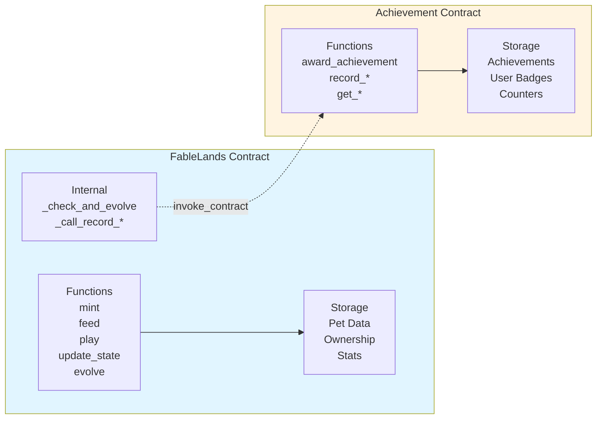

# FableLands
Raise Your NFT Pets in the Stellar Blockchain!

## Important Links

- **Pitch Deck**: [View Pitch Deck](https://www.canva.com/design/DAG4SrMjiq4/7R2xqCHYnN8Femoocf0YCA/view?utm_content=DAG4SrMjiq4&utm_campaign=designshare&utm_medium=link2&utm_source=uniquelinks&utlId=he5bb79aa02)
- **Demo Video**: Coming soon
- **Live Demo**: [Try FableLands](https://fablelands-stellar-sa5q.vercel.app/)

### Smart Contract Addresses

- **fablelands Contract** (Testnet): 
  - Code: [View Here](contracts/fablelands/src/lib.rs)
  - Address: `CCLH6KHEBKNUX4MOLDKINELR34UWXNTFXCF5XXXSGCT4EZKXQN47U3YE`
  - [View on Stellar Explorer](https://stellar.expert/explorer/testnet/contract/CCLH6KHEBKNUX4MOLDKINELR34UWXNTFXCF5XXXSGCT4EZKXQN47U3YE)

- **Achievement Contract** (Testnet):
  - Code: [View Here](contracts/fablelands_achievements/src/lib.rs)
  - Address: `CDCUYVGQWJ44NDSIITVDLYHWJGYS35LLTVVKLYQUGARH2Z7MCREBIALT`
  - [View on Stellar Explorer](https://stellar.expert/explorer/testnet/contract/CDCUYVGQWJ44NDSIITVDLYHWJGYS35LLTVVKLYQUGARH2Z7MCREBIALT)

## Table of Contents

- [Introduction](#introduction)
- [What is a Pet?](#what-is-a-pet)
  - [Stats System](#stats-system)
  - [Evolution Stages](#evolution-stages)
  - [Moods](#moods)
  - [Death and Revival](#death-and-revival)
- [Core Features](#core-features)
  - [NFT Pets That EVOLVE!](#nft-pets-that-evolve)
  - [Play With Your Pets!](#play-with-your-pets)
  - [Hold Context-Aware Conversations!](#hold-context-aware-conversations)
  - [Unlock Achievements!](#unlock-achievements)
- [Stellar Scaffold Framework Integration](#stellar-scaffold-framework-integration)
  - [Smart Contract Development](#smart-contract-development)
  - [Frontend Architecture](#frontend-architecture)
  - [Stellar Wallet Kit Integration](#stellar-wallet-kit-integration)
  - [Deployment and Contract Management](#deployment-and-contract-management)
- [Architecture Overview](#architecture-overview)
  - [Smart Contracts](#smart-contracts)
    - [Contract Architecture](#contract-architecture)
    - [FableLands Contract](#fablelands-contract)
    - [Achievement Contract](#achievement-contract)
    - [Stellar Contract Infrastructure Utilization](#stellar-contract-infrastructure-utilization)
  - [AI Engine](#ai-engine)
    - [OpenAI Integration](#openai-integration)
    - [Image Generation Service](#image-generation-service)
    - [Video Generation Service](#video-generation-service)
    - [Asset Generation Orchestration](#asset-generation-orchestration)
- [Conclusion](#conclusion)

## Introduction
What if your NFT could get hungry? What if it could feel lonely? What if it could remember you played a game with it? What if it could talk back?

FableLands represents a paradigm shift in the NFT space, introducing truly autonomous on-chain companions that exist as living, breathing entities on the Stellar blockchain. Unlike traditional static NFTs, FableLands pets are dynamic digital beings that experience hunger, loneliness, and emotional states. They remember interactions, evolve over time, and engage in meaningful conversations through advanced AI integration.

FableLands is a Crypto-AI game that enables genuine, emotional bonds between users and their digital companions. Each pet is a unique NFT with its own personality, memory, and lifecycle, all managed entirely on-chain through Stellar smart contracts.

## What is a Pet?

A Pet in FableLands is a living, breathing NFT that exists entirely on the Stellar blockchain. Unlike static NFTs, each pet has dynamic stats, emotions, and a complete lifecycle that evolves based on your care and interaction.

### Stats System

Every pet has three core stats that range from **0 to 100**:

- **Happiness**: Measures your pet's emotional well-being. Decreases naturally over time (**every 5 minutes**) and increases when you feed or play with your pet. Happiness directly influences your pet's ability to evolve and their mood.

- **Hunger**: Represents how hungry your pet is. Increases over time (**every 2.5 minutes**) and decreases when you feed them. If hunger **exceeds 80**, your pet's health will start to degrade.

- **Health**: Your pet's physical condition. Decreases when **hunger > 80**, and can increase when your pet is well-fed and happy. If health **reaches 0**, your pet dies.

### Evolution Stages

Pets progress through four distinct evolution stages, each with unique visual assets and personality traits:

1. **Egg** (Stage 0): Your pet starts as a mysterious glowing egg. This stage requires **no conditions** - simply wait **3 minutes (36 ledger sequences)** for your pet to hatch into a Baby.

2. **Baby** (Stage 1): A cute, innocent creature full of wonder. To evolve to Teen stage, your pet must be at least **7 minutes old (84 ledger sequences cumulative from birth)** AND maintain a happiness level of **at least 60**.

3. **Teen** (Stage 2): An energetic, sometimes moody adolescent discovering their personality. To reach the final Adult stage, your pet must be at least **12 minutes old (144 ledger sequences cumulative from birth)**, maintain happiness of **at least 60**, AND have health of **at least 80**.

4. **Adult** (Stage 3): A fully evolved, wise, and loyal companion. This is the final stage - your pet has reached maturity and will remain an Adult for the rest of their life.

### Moods

Your pet's mood is automatically determined by their current stats and affects which emotion-based video plays:

- **Happy**: When **happiness >= 70**, **hunger < 50**, and **health >= 50**. Your pet is content and energetic.

- **Sad**: When **happiness < 50** OR **hunger > 70**. Your pet feels neglected or hungry.

- **Angry**: When **health < 30** OR **happiness < 20**. Your pet is in distress and needs immediate care.

- **Neutral**: All other stat combinations. Your pet is in a balanced state.

### Death and Revival

If your pet's health **reaches 0**, they die. Death is permanent until you choose to revive them. When revived, your pet returns with partial stats:
- **Health: 50**
- **Happiness: 30**
- **Hunger: 50**

Revival costs **0.005 XLM** and gives your pet a second chance at life.

## Core Features

### Play With Your Pets!

Bond with your pet through interactive mini-games that increase their happiness and create lasting memories. FableLands features three classic games you can play directly with your pet:

- **Memory Game**: Test your memory skills by matching pairs of cards. Your pet watches and celebrates when you win!

- **Tic-Tac-Toe**: Challenge your pet to a strategic game of tic-tac-toe. Every victory brings joy to your companion.

- **Rock Paper Scissors**: A quick game of chance that's perfect for a fun break. Your pet gets excited with each round!

Winning any game increases your pet's happiness by 25 points, helping them stay happy and healthy. But the magic doesn't stop there - your pet remembers which game you played! When you chat with them later, they'll reference the specific game you played together, creating personalized conversations that feel genuine and meaningful.

### Hold Context-Aware Conversations!

Your pet doesn't just respond to your messages - they understand their entire world and remember your shared history. Powered by GPT-4o, each conversation is deeply personalized based on multiple layers of context:

**Evolution Stage Personality**: Each stage has a distinct personality. Eggs communicate through mystical vibrations, Babies are excitable and innocent, Teens are energetic but moody, and Adults are wise and protective. The AI maintains this personality consistently across all conversations.

**Current Stats Awareness**: Your pet knows exactly how they're feeling. If they're very hungry (hunger > 80), they'll express weakness. If happiness is low (< 50), they'll show sadness. Perfect stats (all at 100) result in energetic, joyful expressions. The AI analyzes all three stats (happiness, hunger, health) to determine the pet's emotional state.

**Timeline Memory**: Your pet remembers everything that's happened in their life. They know when they were born, when they evolved, when you last fed them, when you played games together, and all the milestones they've reached. This creates continuity that makes conversations feel like talking to a real companion with a memory.

**Recent Action Context**: The AI remembers your last interaction. If you just fed your pet, they'll thank you. If you just played a game, they'll talk about how much fun it was. If you just refreshed their state, they'll acknowledge it. This creates natural conversation flow that responds to your actions.

**Game-Specific Memory**: When you win a game, your pet remembers which specific game it was (Memory Game, Tic-Tac-Toe, or Rock Paper Scissors) and can reference it in future conversations, making each interaction unique and personal.

### Unlock Achievements!

Track your pet-raising journey through a comprehensive achievement system that rewards milestones and dedication. Achievements are automatically awarded on-chain and function as collectible NFT badges.

**Achievement Types:**

- **First Steps** (Common): Mint your first pet and begin your journey.

- **Metamorphosis** (Rare): Witness your pet's first evolution from Egg to Baby.

- **Death Survivor** (Rare): Revive a pet from death, giving them a second chance at life.

- **Triple Evolution** (Epic): Guide your pet to the Teen stage, showing mastery of pet care.

- **Perfectionist** (Epic): Achieve the ultimate goal - get all three stats (happiness, hunger, health) to perfect 100 simultaneously.

- **Streak Master** (Uncommon): Feed your pet 10 times, showing consistent care and dedication.

- **Active Player** (Uncommon): Play with your pet 10 times, building a strong bond through games.

- **Legend** (Legendary): Reach the pinnacle - evolve your pet to the final Adult stage. This is the ultimate achievement, reserved for the most dedicated pet owners.

Each achievement is permanently recorded on-chain and can be viewed in your achievement gallery. The system uses an ERC-1155-like structure, making achievements collectible NFT badges that prove your accomplishments in the FableLands universe.

## Stellar Scaffold Framework Integration

FableLands leverages the Scaffold Stellar framework to accelerate development and simplify deployment of Stellar smart contracts and frontend applications.

### Smart Contract Development

Scaffold Stellar eliminates boilerplate by generating smart contract projects written in Rust and compiled to WebAssembly. The framework provides automated contract structure with proper Soroban SDK imports, type-safe TypeScript client generation, hot reload support for rapid iteration, and centralized environment configuration through `environments.toml`. See [contracts/fablelands/src/lib.rs](contracts/fablelands/src/lib.rs) and [contracts/fablelands_achievements/src/lib.rs](contracts/fablelands_achievements/src/lib.rs)

### Frontend Architecture

The frontend is built with modern TypeScript and React tooling using Vite. The application follows a component-based architecture with modularized pet management, game components, chat interfaces, and achievement displays. Contract integration is handled through `src/services/petworldContract.ts`, state management uses React hooks, and routing is managed by React Router. See [src/services/petworldContract.ts](src/services/petworldContract.ts)

### Stellar Wallet Kit Integration

The Stellar Wallet Kit provides standardized wallet connections and transaction signing:

- **Multi-Wallet Support:** Supports multiple Stellar wallet providers through the Wallet Kit abstraction.

- **Transaction Signing:** All contract interactions require wallet authentication, handled transparently by the Wallet Kit.

- **Balance Management:** Real-time balance queries and display for user account status.

- **Network Configuration:** Wallet operations automatically use the configured network from environment variables.

### Deployment and Contract Management

Scaffold Stellar simplifies contract deployment through the `stellar registry` command system, enabling contract publishing, instance deployment with constructor parameters, and local alias management for development workflows.

**Deployed Contracts:**
- **FableLands Contract:** `CCLH6KHEBKNUX4MOLDKINELR34UWXNTFXCF5XXXSGCT4EZKXQN47U3YE` (Testnet)
- **FableLands Achievement Contract:** `CDCUYVGQWJ44NDSIITVDLYHWJGYS35LLTVVKLYQUGARH2Z7MCREBIALT` (Testnet)

## Architecture Overview

FableLands is built on a multi-layered architecture combining Stellar smart contracts, AI services, and modern web technologies to create an immersive pet ownership experience.

### Smart Contracts

The application leverages two primary smart contracts deployed on the Stellar Testnet, working in tandem to provide comprehensive pet management and achievement tracking functionality.

#### Contract Architecture

#### FableLands Contract

The FableLands contract (`contracts/fablelands/src/lib.rs`) serves as the core NFT and pet management system. It implements a comprehensive pet lifecycle with the following key functionalities:

**Core Functions:**

- **`initialize(env, owner)`** - Initializes the contract with ownership and configurable constants including stat decay rates, evolution thresholds, and action costs. See [contracts/fablelands/src/lib.rs:58](contracts/fablelands/src/lib.rs#L58)

- **`mint(env, caller, name)`** - Mints a new pet NFT with a unique token ID. Each pet starts as an Egg with maximum stats (happiness: 100, hunger: 0, health: 100). The function automatically calls the achievement contract to award the "First Steps" achievement. See [contracts/fablelands/src/lib.rs:81](contracts/fablelands/src/lib.rs#L81)

- **`update_state(env, token_id)`** - Implements time-based stat decay using Stellar ledger sequence numbers. Hunger increases and happiness decreases based on elapsed ledgers since last update. Health degrades when hunger exceeds 80. The function automatically checks for death conditions and triggers evolution when thresholds are met. See [contracts/fablelands/src/lib.rs:153](contracts/fablelands/src/lib.rs#L153)

- **`feed(env, caller, token_id)`** - Reduces hunger by 40 points and increases happiness by 15 points. Requires authentication and ownership verification. Automatically calls the achievement contract to track feed count for milestone achievements. See [contracts/fablelands/src/lib.rs:233](contracts/fablelands/src/lib.rs#L233)

- **`play(env, caller, token_id)`** - Increases happiness by 25 points. Used after winning games in the frontend. Tracks play count for achievement milestones. See [contracts/fablelands/src/lib.rs:286](contracts/fablelands/src/lib.rs#L286)

- **`revive(env, caller, token_id)`** - Resurrects a dead pet with partial stats (health: 50, happiness: 30, hunger: 50). Awards the "Death Survivor" achievement. See [contracts/fablelands/src/lib.rs:329](contracts/fablelands/src/lib.rs#L329)

- **`get_pet_info(env, token_id)`** - Returns comprehensive pet information including name, birth date, age, evolution stage, current stats, and death status. See [contracts/fablelands/src/lib.rs:375](contracts/fablelands/src/lib.rs#L375)

- **`get_user_pets(env, user)`** - Returns a vector of all token IDs owned by a specific address, enabling efficient pet collection queries. See [contracts/fablelands/src/lib.rs:400](contracts/fablelands/src/lib.rs#L400)

- **`batch_update_state(env, token_ids)`** - Allows batch state updates for multiple pets, used by the automatic cron job to maintain all pets simultaneously. See [contracts/fablelands/src/lib.rs:420](contracts/fablelands/src/lib.rs#L420)

**Evolution System:**

The contract implements a four-stage evolution system (Egg → Baby → Teen → Adult) based on ledger sequence progression and happiness thresholds. Evolution is automatically checked after state updates, feed, and play actions. Each stage requires a minimum happiness level (60) and specific ledger count thresholds.

**Stat Management:**

Pets have three core stats managed entirely on-chain:
- **Happiness** (0-100): Decreases over time, increases through feeding and playing
- **Hunger** (0-100): Increases over time, decreases through feeding
- **Health** (0-100): Decreases when hunger exceeds 80, increases when well-fed and happy

**Contract Address:**
- **Testnet:** `CCLH6KHEBKNUX4MOLDKINELR34UWXNTFXCF5XXXSGCT4EZKXQN47U3YE`
- **Explorer:** [View on Stellar Explorer](https://stellar.expert/explorer/testnet/contract/CCLH6KHEBKNUX4MOLDKINELR34UWXNTFXCF5XXXSGCT4EZKXQN47U3YE)

#### Achievement Contract

The Achievement contract (`contracts/fablelands_achievements/src/lib.rs`) implements an ERC-1155-like achievement system that tracks user accomplishments and awards NFT badges for milestones.

**Core Functions:**

- **`initialize(env, owner)`** - Initializes the contract and pre-populates eight achievement definitions with varying rarities (Common, Uncommon, Rare, Epic, Legendary). See [contracts/fablelands_achievements/src/lib.rs:46](contracts/fablelands_achievements/src/lib.rs#L46)

- **`award_achievement(env, caller, user, achievement_id, pet_token_id)`** - Awards an achievement badge to a user. Only callable by the FableLands contract or owner. Tracks both user-level and pet-specific achievements. See [contracts/fablelands_achievements/src/lib.rs:93](contracts/fablelands_achievements/src/lib.rs#L93)

- **`record_first_pet(env, caller, user, pet_token_id)`** - Automatically called by FableLands contract on mint to award "First Steps" achievement. See [contracts/fablelands_achievements/src/lib.rs:157](contracts/fablelands_achievements/src/lib.rs#L157)

- **`record_feed(env, caller, user, pet_token_id)`** - Tracks feed count and awards "Streak Master" achievement after 10 feeds. See [contracts/fablelands_achievements/src/lib.rs:181](contracts/fablelands_achievements/src/lib.rs#L181)

- **`record_play(env, caller, user, pet_token_id)`** - Tracks play count and awards "Active Player" achievement after 10 plays. See [contracts/fablelands_achievements/src/lib.rs:214](contracts/fablelands_achievements/src/lib.rs#L214)

- **`record_evolution(env, caller, user, pet_token_id, stage)`** - Awards evolution-based achievements including "Metamorphosis", "Triple Evolution", and "Legend" for reaching Adult stage. See [contracts/fablelands_achievements/src/lib.rs:247](contracts/fablelands_achievements/src/lib.rs#L247)

- **`get_user_achievements(env, user)`** - Returns all achievement IDs earned by a user. See [contracts/fablelands_achievements/src/lib.rs:347](contracts/fablelands_achievements/src/lib.rs#L347)

- **`get_pet_achievements(env, pet_token_id)`** - Returns all achievement IDs earned by a specific pet. See [contracts/fablelands_achievements/src/lib.rs:365](contracts/fablelands_achievements/src/lib.rs#L365)

- **`get_all_achievements(env)`** - Returns the complete list of all available achievements with their metadata. See [contracts/fablelands_achievements/src/lib.rs:395](contracts/fablelands_achievements/src/lib.rs#L395)

- **`has_earned(env, user, achievement_id)`** - Checks if a user has earned a specific achievement. See [contracts/fablelands_achievements/src/lib.rs:410](contracts/fablelands_achievements/src/lib.rs#L410)

**Achievement Types:**

The contract defines eight achievements across five rarity tiers:
1. First Steps (Common) - Mint first pet
2. Metamorphosis (Rare) - First evolution
3. Death Survivor (Rare) - Revive a pet
4. Triple Evolution (Epic) - Reach Teen stage
5. Perfectionist (Epic) - All stats at 100
6. Streak Master (Uncommon) - Feed 10 times
7. Active Player (Uncommon) - Play 10 times
8. Legend (Legendary) - Reach Adult stage

**Contract Address:**
- **Testnet:** `CDCUYVGQWJ44NDSIITVDLYHWJGYS35LLTVVKLYQUGARH2Z7MCREBIALT`
- **Explorer:** [View on Stellar Explorer](https://stellar.expert/explorer/testnet/contract/CDCUYVGQWJ44NDSIITVDLYHWJGYS35LLTVVKLYQUGARH2Z7MCREBIALT)

#### Stellar Contract Infrastructure Utilization

FableLands leverages several key Stellar Soroban features to enable its functionality:

**Persistent Storage:**
The contracts use Soroban's persistent storage to maintain pet state, ownership mappings, and achievement records. This enables efficient on-chain data retrieval without requiring external indexing services. The FableLands contract stores pet structs, token ownership, and user balances in persistent storage, while the Achievement contract maintains achievement definitions and user achievement mappings.

**Instance Storage:**
Configuration constants such as stat decay rates, evolution thresholds, and action costs are stored in instance storage, allowing for future upgrades and parameter adjustments without redeployment.

**Cross-Contract Invocations:**
The FableLands contract makes cross-contract calls to the Achievement contract to automatically track user actions and award achievements. This enables seamless integration between pet management and achievement tracking without requiring users to interact with multiple contracts.

**Ledger-Based Time Tracking:**
The application uses Stellar ledger sequence numbers as a decentralized time source. Pet stats decay based on elapsed ledgers, and evolution stages progress according to ledger-based thresholds. This eliminates the need for external oracles or timestamp services.

**Authentication and Authorization:**
All state-modifying functions require authentication via `require_auth()`, ensuring only authorized users can interact with their pets. Ownership verification prevents unauthorized access to pet management functions.

**Batch Operations:**
The `batch_update_state` function enables efficient bulk updates, allowing the automatic maintenance system to update all pets in a single transaction, reducing gas costs and improving scalability.

## AI Engine

FableLands integrates multiple AI services to create dynamic, context-aware pet interactions and generate unique visual assets for each pet.

### OpenAI Integration

The OpenAI service powers conversational AI for pets using GPT-4o, enabling natural language interactions that adapt to the pet's current state and recent history. The AI maintains context through evolution stage personality, current stats analysis, recent action memory, game context, and token-specific storage. See [src/services/openaiService.ts](src/services/openaiService.ts)

### Image Generation Service

The image generation service creates unique pet avatars using AI-powered image synthesis. Prompts are constructed based on creature type (dragon, unicorn, dino), evolution stage, life quality modifiers derived from stats, and pet name integration. Generated images are stored in S3 and referenced in Supabase metadata. See [src/services/imageGenerationService.ts](src/services/imageGenerationService.ts)

### Video Generation Service

The video generation service generates three emotion-based videos (happy, sad, angry) from pet avatar images using an asynchronous job-based workflow. The service polls for completion and stores videos in S3. The frontend automatically selects and plays the appropriate video based on the pet's current mood determined by stat thresholds. See [src/services/videoGenerationService.ts](src/services/videoGenerationService.ts)

### Asset Generation Orchestration

The pet asset service orchestrates the complete asset generation workflow, ensuring atomic operations where either all assets are generated successfully or the operation fails entirely. The workflow includes user creation/retrieval from Supabase, avatar image generation, video generation for all three emotions, metadata storage, and evolution-triggered asset regeneration. See [src/services/petAssetService.ts](src/services/petAssetService.ts)

## Conclusion

FableLands represents the future of NFTs - where digital assets are not just collectibles, but living companions that grow, learn, and form genuine emotional bonds with their owners. By combining the power of Stellar blockchain, advanced AI, and innovative game mechanics, we've created an experience where every interaction matters and every pet has a unique story to tell.

Your pet remembers when you fed them, celebrates when you play games together, and evolves based on your care. They express their emotions through dynamic visuals and engage in meaningful conversations that adapt to their current state and your shared history. This isn't just an NFT - it's a digital companion that truly lives on the blockchain.

**Ready to start your journey?** [Try FableLands now](https://fablelands-stellar-sa5q.vercel.app/) and experience the next generation of NFT ownership. Mint your first pet, watch them evolve, play games together, and unlock achievements as you build an unbreakable bond with your on-chain companion.

The future of NFTs is alive, and it's waiting for you.
